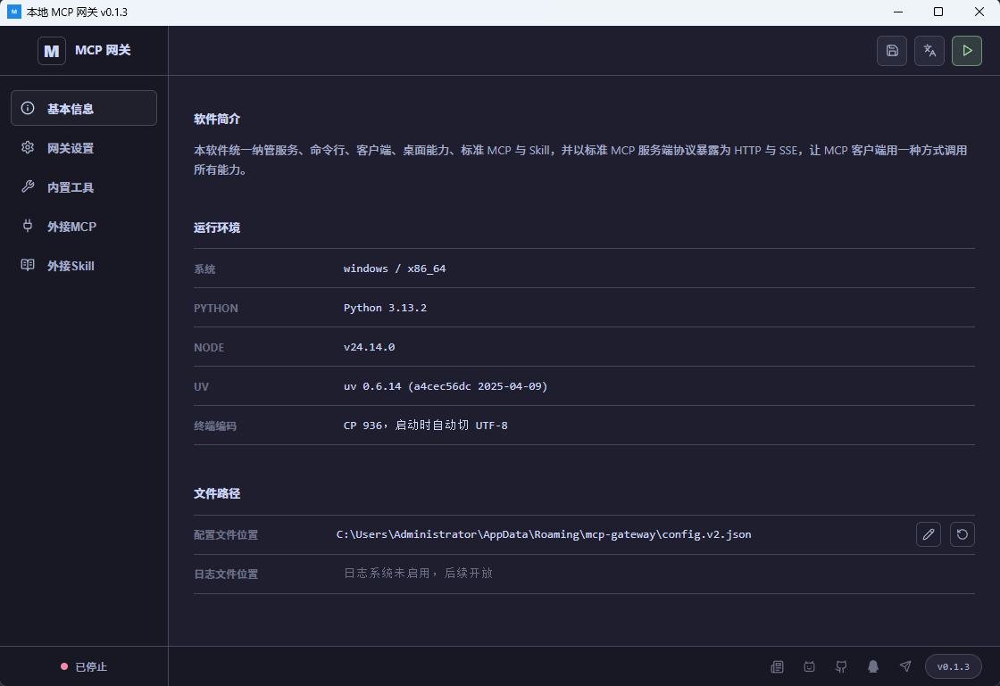
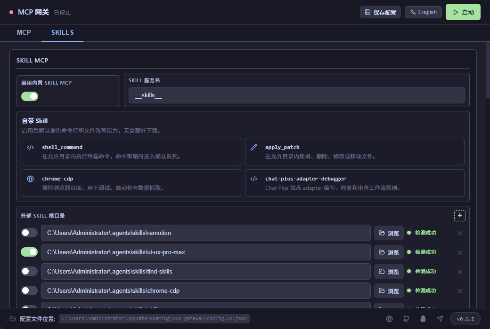
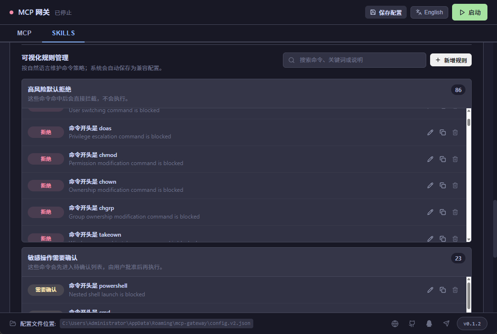

# 本地 MCP Gateway（最新）

[English](./README.md) | [中文](./README.zh.md)

MCP Gateway 是一个 MCP（Model Context Protocol）服务器网关。  
它把多个 MCP Server 统一接入一个入口，提供代理转发、认证、管理 API，以及新增的 `SKILLS` 能力。

最常见的用途：把本地 `stdio` MCP 服务转换成远程可访问的 `SSE / Streamable HTTP` MCP 服务，供桌面端或浏览器端 AI 客户端接入，使得网页端的ai聊天窗口可以使用工具和skills。

## 功能总览

- 统一管理多个 MCP 服务（可视化 + JSON 双编辑模式）
- 网关统一转发 `SSE`：默认`GET|POST /api/v2/sse/<serverName>`
- 网关统一转发 `HTTP`：默认`POST /api/v2/mcp/<serverName>`
- 内置安全认证（Admin Token / MCP Token）
- `SKILLS` 标签页支持内置 Skill MCP 服务管理
- 自带 Skill：`shell_command`、`apply_patch`、`chrome-cdp`、`chat-plus-adapter-debugger`
- 外部 Skill 根目录管理，支持单独启用/禁用和 `SKILL.md` 校验
- 访问边界 / 路径守卫（允许访问目录 + 越界策略）
- 执行限制（超时、最大输出）
- 可视化策略规则管理（`拒绝 / 需要确认`、搜索、新增、编辑、复制、删除）
- 待确认命令审批（Approve / Reject）与确认弹窗

## 界面预览

### Image one（MCP 主配置）

### Image two（SKILLS 设置、自带 Skill 与外部根目录）

最新版 SKILLS 设置页展示了 Skill MCP 开关、Skill 服务名、自带 Skill 列表，以及外部 Skill 根目录。每个外部根目录都可以单独浏览、检测、启用/禁用和删除。

### Image three（可视化策略规则管理）

最新版策略页已从旧版“仅 JSON 规则说明”升级为可视化规则管理。规则按处理动作分组，可按命令、关键词或说明搜索，并支持在界面中新增、编辑、复制和删除。

## 1. MCP 标签页怎么填

### 网关设置

- `监听地址`：网关监听地址与端口，例如 `127.0.0.1:8765`
- `SSE 路径`：默认 `"/api/v2/sse"`
- `HTTP 流路径`：默认 `"/api/v2/mcp"`

最终访问地址规则：

- `SSE`: `http://<监听地址><SSE路径>/<服务名>`
- `HTTP`: `http://<监听地址><HTTP路径>/<服务名>`

示例（监听 `127.0.0.1:8765`）：

- `http://127.0.0.1:8765/api/v2/sse/filesystem`
- `http://127.0.0.1:8765/api/v2/mcp/filesystem`

### 安全配置（密码 / Token）

- `ADMIN TOKEN`：管理接口令牌，保护 `/api/v2/admin/*`
- `MCP TOKEN`：MCP 调用令牌，保护 `/api/v2/mcp/*` 和 `/api/v2/sse/*`

说明：

- 在当前 UI 中，Token 留空即该类认证关闭
- 对外开放时建议开启并使用随机长 Token（可视为网关密码）
- 客户端调用时加请求头：`Authorization: Bearer <你的token>`

### MCP 服务列表

每一行代表一个 MCP 服务：

- 开关：启用/禁用该服务
- `名称`：服务名（会出现在 URL 末尾）
- `命令`：启动命令（如 `npx`）
- `参数`：命令参数
- `+`：添加环境变量
- `x`：删除服务

示例（Playwright MCP）：

1. 名称：`playwright`
2. 命令：`npx`
3. 参数：`-y @playwright/mcp@latest`

## 2. 新增 SKILLS 功能说明

`SKILLS` 标签页用于启用并管理内置 Skill MCP 服务：

1. 打开 `启用内置 SKILL MCP`。
2. 设置 `Skill 服务名`（默认 `__skills__`）。
3. 查看自带 Skill：`shell_command`、`apply_patch`、`chrome-cdp`、`chat-plus-adapter-debugger`。
4. 添加 `外部 Skill 根目录`，检测每个目录下是否直接存在 `SKILL.md`，并只启用需要暴露的根目录。
5. 配置 `允许访问目录`。启用 Skill MCP 时访问边界为必填；命令执行和文件修改都必须留在允许访问目录内，除非你选择的越界动作允许继续。
6. 选择越界动作：`allow / confirm / deny`。
7. 设置执行限制：`执行超时（毫秒）`（最小 `1000`）和 `最大输出（字节）`（最小 `1024`）。
8. 在可视化规则管理中维护策略规则。规则支持 `拒绝` 和 `需要确认`，可按命令开头匹配、关键词匹配，并支持搜索、新增、编辑、复制、删除；高级 JSON 编辑仍保留，用于批量粘贴或手工迁移。
9. 运行后可在 `待确认命令` 中审批高风险命令，也可以通过确认弹窗直接处理。

当网关运行且 SKILLS 已启用时，界面会展示：

- `Skill SSE`：`http://<监听地址><SSE路径>/<skillsServerName>`
- `Skill HTTP`：`http://<监听地址><HTTP路径>/<skillsServerName>`

## 3. 推荐使用流程

1. 在 `MCP` 标签页配置监听地址和路径。
2. 按需设置 `ADMIN TOKEN`、`MCP TOKEN`（建议生产环境开启）。
3. 添加 MCP 服务并保存配置。
4. 切到 `SKILLS` 标签页完成 Skill 能力配置（可选）。
5. 点击右上角 `启动`，状态变为“运行中”。
6. 复制生成的 `SSE / HTTP` 地址到你的 MCP 客户端。

## 4. 可视化 / JSON 两种编辑方式

- `可视化`：表单维护，适合常规配置
- `JSON`：直接编辑 `mcpServers` 对象

两种方式可来回切换。若 JSON 格式错误，界面会提示并阻止启动。

## 5. 配置文件位置

界面底部会显示当前配置文件路径。默认通常为：

- Windows: `%APPDATA%\mcp-gateway\config.v2.json`
- macOS: `~/Library/Application Support/mcp-gateway/config.v2.json`
- Linux: `~/.config/mcp-gateway/config.v2.json`

## 6. 常见问题

1. 启动失败  
检查每个服务是否至少填写了 `名称` + `命令`。
2. 端口被占用  
改监听端口（例如 `127.0.0.1:9876`）后重试。
3. 客户端连不上  
检查服务是否启用、URL 是否与界面一致（路径和服务名）。
4. SKILLS 根目录无法启用  
确认该目录下直接存在 `SKILL.md`（当前为非递归检查）。

## 7. 免责声明

- 本软件提供 `SKILLS` 能力，可能在你的授权下调用系统命令或脚本。
- 虽然本软件已内置命令规则、路径守卫、确认机制等安全控制，但无法保证覆盖所有场景并完全避免风险。
- 因使用 `SKILLS` 或命令执行导致的任何后果（包括但不限于数据丢失、系统异常、文件损坏、业务中断、硬件或软件损失等），均由使用者自行承担。
- 本软件作者与维护者不对上述损失承担任何直接、间接、附带或连带责任。
- 建议在受控环境中先验证高风险命令，并自行做好数据备份与权限隔离。
