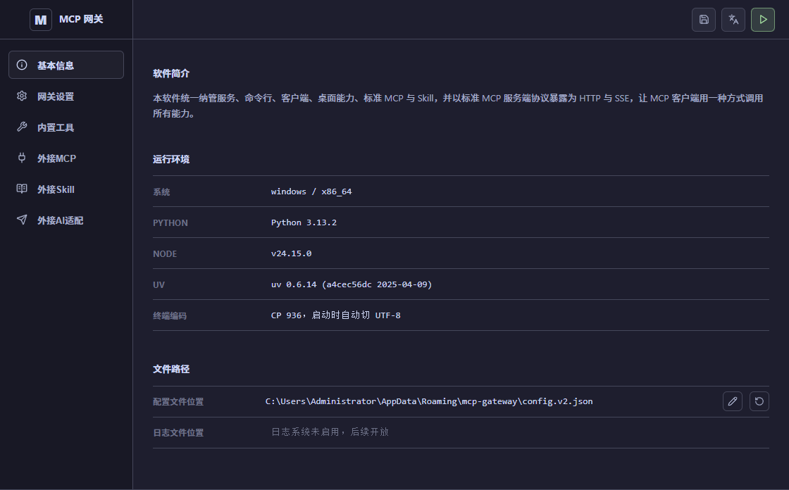

# 本地 MCP Gateway

[English](./README.md) | [中文](./README.zh.md)

本地 MCP Gateway 是一个给 MCP 客户端使用的本地网关。

它把本机能力暴露成标准 MCP `SSE` 和 `Streamable HTTP` 接口，让其他 MCP 客户端通过一个入口调用。上游可以接普通 stdio MCP 服务、自定义 Skill、内置工具，也可以接桌面和浏览器自动化能力。

简单说，它会把你的电脑变成一个可控的 MCP 工具中心：客户端可以通过它读文件、改文件、执行命令、操作浏览器，或者调用你自己写的 Skill 工作流；同时配置、鉴权、目录边界、命令审批都集中在一个界面里管理。



## 它能做什么

- 把 MCP 服务暴露为 `SSE` 和 `Streamable HTTP`
- 把本地 stdio MCP 服务转换成其他客户端可访问的接口
- 在一个界面里统一管理多个 MCP 服务
- 固定暴露外部 Skill 和内置 Skill 两组 MCP 服务
- 自带文件读取、命令执行、多文件修改、浏览器控制、适配调试等工具
- 提供 AI 外接适配器，从 AI 编程工具（OpenAI / Anthropic 协议）侧摄入工具定义，发布为 MCP 工具供 MCP 客户端调用
- 支持允许访问目录、命令策略、执行限制和人工确认
- Skill 形态比较省 token：核心说明放在小型 `SKILL.md` 文档里，客户端需要用时再读取完整说明

## 接口形式

假设你配置了一个名为 `<serverName>` 的 MCP 服务：

```text
SSE:  http://<监听地址>/api/v2/sse/<serverName>
HTTP: http://<监听地址>/api/v2/mcp/<serverName>
```

Skill 端点是固定的：

```text
外部 Skills: /api/v2/sse/__skills__
外部 Skills: /api/v2/mcp/__skills__
内置 Skills: /api/v2/sse/__builtin_skills__
内置 Skills: /api/v2/mcp/__builtin_skills__
```

AI 外接适配器界面会复制一个用户友好的 OpenAI / Anthropic 兼容 Base URL，供支持自定义 API 的 AI 编程工具使用：

```text
Base URL: http://<监听地址>/api/v2/ai/v1
```

后端规范基准路径仍是 `/api/v2/ai`。客户端可调用以下 canonical 协议接口：

```text
模型列表:  GET  /api/v2/ai/v1/models
对话:      POST /api/v2/ai/v1/chat/completions
响应:      POST /api/v2/ai/v1/responses
消息:      POST /api/v2/ai/v1/messages
Token 计数: POST /api/v2/ai/v1/messages/count_tokens
健康检查:  GET  /api/v2/ai/health
```

如果客户端会在复制出来的 Base URL 后自动再拼一层 `/v1`，后端也接受兼容路径 `/api/v2/ai/v1/v1/...`，包括模型列表、对话、Responses、Anthropic Messages 和 Token 计数。Claude Code 用户不需要手动删除界面复制地址里的 `/v1`。

如果配置了 `MCP Token`，客户端请求需要带上：

```text
Authorization: Bearer <你的_mcp_token>
```

## 基本用法

1. 打开应用，设置监听地址，例如 `127.0.0.1:8765`。
2. 添加本地 MCP 服务，比如 filesystem、Playwright 这类 stdio MCP。
3. 按需启用内置工具，或添加外部 Skill 目录。
4. 配置允许访问目录、命令确认规则和执行限制。
5. 启动网关。
6. 把生成的 `SSE` 或 `HTTP` 地址复制到你的 MCP 客户端。

示例：

```text
http://127.0.0.1:8765/api/v2/sse/playwright
```

## Skills 与内置工具

网关会暴露两类 Skill MCP 服务：

- `__skills__`：来自你添加的外部目录，每个 Skill 由一个 `SKILL.md` 描述。
- `__builtin_skills__`：网关自带的一组实用工具。

当前内置工具包括：

- `read_file`
- `shell_command`
- `multi_edit_file`
- `task-planning`
- `chrome-cdp`
- `chat-plus-adapter-debugger`（业务场景专用）
- `officecli`
- `codegraph`


`chat-plus-adapter-debugger` 专门服务于 Chat Plus 站点适配流程，不是通用能力；做通用智能体时建议关掉它，避免上下文被业务规则占用。

这些能力可以让普通 MCP 客户端具备更接近智能体的工作流：查看项目、读取文档、修改代码、执行命令、验证结果、操作浏览器，并且所有调用仍然走标准 MCP 接口。

## AI 外接适配器（BYOK）


AI 外接适配器接收来自支持自定义 API 端点的 AI 编程工具（OpenAI 或 Anthropic 协议）的连接。AI 工具接入时会在请求中携带自己的工具定义，网关提取这些工具，注册为 MCP 工具，并通过专用 MCP 端点暴露出去——这样 MCP 客户端就能调用 AI 工具所声明的那些工具。

使用方式：

1. 在界面中开启 AI 外接适配器开关。
2. 添加一个或多个 API Key（留空则接受所有连接）。
3. 复制 Base URL，填入你的 AI 编程工具作为 API 端点。
4. AI 工具发送请求后，网关自动提取系统提示词和工具定义，为该会话创建 MCP 服务端点。
5. 将 MCP 客户端连接到该会话的 MCP 端点，即可调用这些工具。

关键特性：

- 网关本身不运行任何 AI 模型，只负责从 AI 工具侧摄入工具定义并发布为 MCP 工具。
- 不校验模型名——客户端传任何模型名都可以正常使用。
- 每个连接会创建一个会话，在界面中可查看协议类型、工具列表，并实时开关工具。
- 支持三种协议：OpenAI Chat Completions、OpenAI Responses、Anthropic Messages。

## 安全提示

部分 Skill 和内置工具可以执行命令、修改文件或控制本地应用。如果你要把网关暴露给本机以外的客户端，建议开启 `Admin Token` 和 `MCP Token`，并提前配置允许访问目录、确认规则和执行限制。

你需要自行确认并承担已授权命令和工具调用带来的结果。
